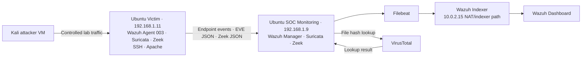
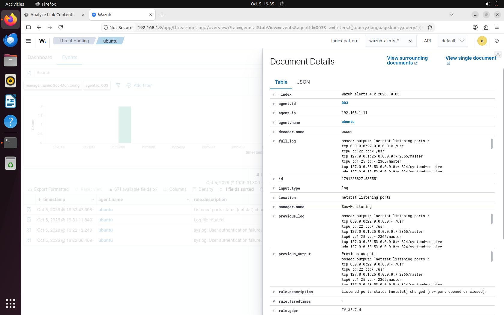
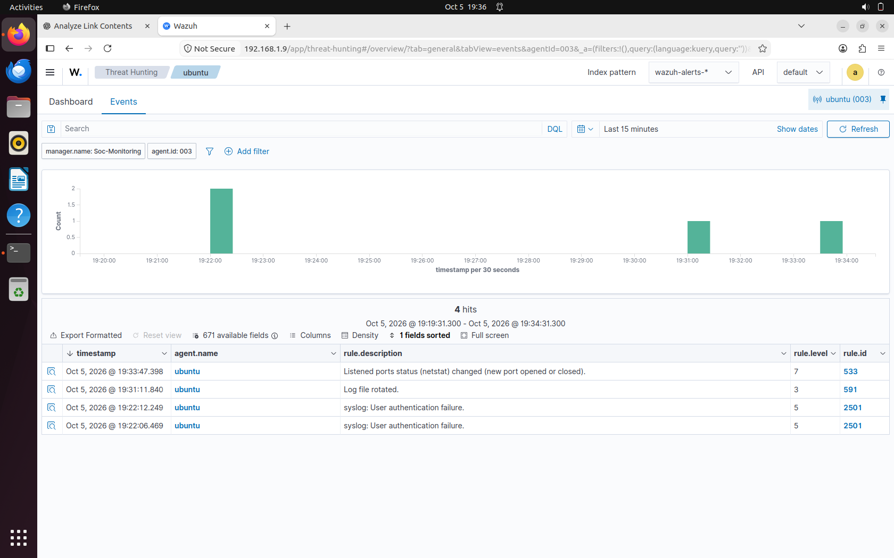
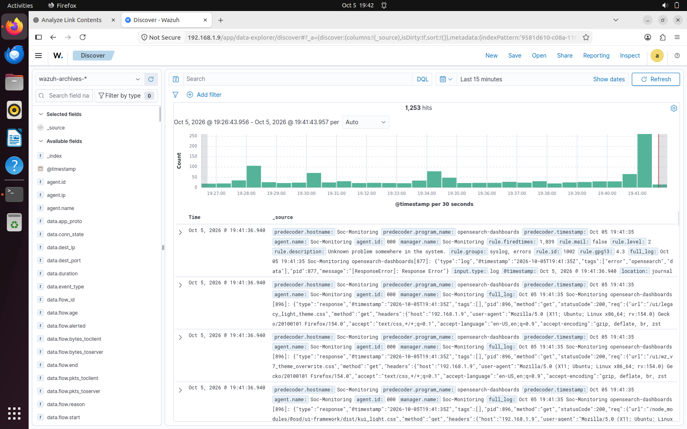

# Alen Intelligent SOC Platform

## Project overview

**Author:** Alen  
**Project type:** Virtual machine SOC lab and cybersecurity portfolio  
**Documentation finalized:** 6 October 2026

Built a centralized SOC lab that combines Wazuh endpoint monitoring, Suricata network alerts, Zeek connection telemetry, file integrity monitoring, and VirusTotal hash enrichment. Controlled tests demonstrated SSH brute-force detection, network telemetry collection, file-change detection, and a working threat-intelligence lookup. Nmap, Gobuster, and reverse-shell-related exercises supplied investigation scenarios; their associated telemetry is distinguished from explicit attack signatures.

The objective was to practice the full path from activity on a monitored Linux endpoint to collection, analysis, indexing, and investigation in Wazuh. The project is complete as a portfolio lab within the scope described below. It is not a production SOC or an automated incident-response system. “Intelligent” refers to combined detection and threat-intelligence enrichment; no machine-learning detection is claimed.

## Final scope

The completed platform includes three VM roles, Wazuh Manager, Indexer, Dashboard and Filebeat, Wazuh Agent 003, Suricata, Zeek, SSH, Apache, realtime FIM, and VirusTotal integration. Email alerting was deferred and remains optional. The custom Flask backend, SQLite API, and custom frontend were abandoned and are outside the final architecture.

## Architecture

Attack traffic targets the Victim VM. Its Wazuh agent forwards endpoint and collected sensor events to the monitoring server. Wazuh analyzes events, Filebeat ships enabled outputs to the indexer, and the dashboard supports alert review and archive searches. VirusTotal enriches file-integrity events through hash lookups. Suricata and Zeek are present on both Ubuntu roles; sensor visibility depends on the capture interface and traffic path. Installation on the monitoring VM alone does not prove it can observe all Victim traffic without routing or mirroring.

## VM and network inventory

| VM role | Address or identifier | Components and purpose |
| --- | --- | --- |
| Kali attacker | IP not retained in final record | Nmap, SSH brute-force exercise, Gobuster, reverse-shell-related testing |
| Ubuntu Victim | 192.168.1.11; Wazuh Agent 003; dashboard name ubuntu | Monitored endpoint; Wazuh Agent, Suricata, Zeek, SSH and Apache |
| Ubuntu SOC Monitoring | 192.168.1.9 bridged; name Soc-Monitoring | Manager, Indexer, Dashboard, Filebeat, Suricata and Zeek |
| Monitoring NAT path | 10.0.2.15 | Separate NAT/indexer path recorded for the monitoring server; not another VM |

Agent 003 was verified active at 192.168.1.11. The bridged monitoring address provides the lab-facing path; the NAT address belongs to a different network context and should not be treated as interchangeable with 192.168.1.9. Kali IP, adapter names, exact software versions, VM CPU/RAM allocations, and a complete port inventory are not specified here.

## Technologies

Wazuh provides endpoint collection, event decoding, rules, FIM, indexing integration and investigation views. Suricata provides network alerts in EVE JSON. Zeek provides structured connection metadata through JSON conn.log records. Filebeat connects Wazuh outputs to the indexer. VirusTotal supplies hash reputation lookup results. Ubuntu hosts the monitoring and target services, while Kali supplies controlled test tools. Apache supplies the web-enumeration target and SSH supplies the authentication target.

## Implementation

### Endpoint enrollment and centralized monitoring

The Victim was enrolled as Agent 003 and verified active. Endpoint identity and source IP were used to constrain investigations and separate Victim events from monitoring-server activity. Alerts were reviewed in Threat Hunting against wazuh-alerts-*; raw archived records were investigated in Discover against wazuh-archives-*.

### Suricata collection

Suricata EVE JSON was integrated into Wazuh. Rule 86601 appeared in the integrated event pipeline. Its presence establishes Suricata alert ingestion; an attack-specific assertion requires the underlying Suricata signature, endpoint fields and matching test time. Rule 86601 alone does not identify Nmap or a reverse shell. EVE collection must point to the actual sensor output and preserve readable JSON records.

### Zeek collection

Zeek conn.log was configured for JSON output and ingested into Wazuh archives. Connection fields can support investigation of source and destination addresses, ports, protocol, duration, byte counts and connection state. Archive indexing exposes records that may not produce a security alert. The recovered archive screenshot shows a populated archive view and available telemetry fields, but its visible rows are monitoring-server logs rather than an isolated Zeek reverse-shell connection.

### SSH detection engineering

A custom Wazuh SSH brute-force rule, 100100, was implemented at level 10 and verified during controlled authentication testing. This demonstrates custom detection engineering and alert review. The exact XML, correlation frequency, time window, parent-rule dependency and grouping conditions are not reproduced because the final record does not retain them. Level 10 is the configured severity, not an independently measured risk score or detection accuracy metric.

### Realtime file integrity monitoring

Realtime FIM monitored /etc/soc-vt-test.txt. A controlled modification produced Rule 550, indicating an integrity checksum change. This validates file-change visibility for the test file; it does not establish monitoring coverage for every filesystem path or prove the change was malicious.

### VirusTotal enrichment

VirusTotal integration was verified following a file hash lookup with Rule 87103 and the message “VirusTotal: Alert - No records in VirusTotal database”. This confirms the lookup workflow returned a no-record result. It does not prove malware detection, a clean verdict, or file-content upload. API credentials are excluded from all documentation and examples.

## Detection use cases and results

| Controlled exercise | Recorded result | Interpretation and boundary |
| --- | --- | --- |
| Endpoint monitoring | Agent 003 active at 192.168.1.11 | Endpoint enrollment and connectivity verified |
| Nmap scan | Scan performed; associated Suricata events integrated through 86601 | Network alert pipeline demonstrated; no explicit Nmap signature asserted |
| SSH brute force | Custom Rule 100100 at level 10 | Custom authentication detection demonstrated; no claim of successful login |
| Gobuster web enumeration | Controlled enumeration work against Apache | Exercise completed; dedicated web detection and terminal screenshot not retained |
| File modification | Rule 550 for /etc/soc-vt-test.txt | Realtime FIM checksum change verified |
| Threat intelligence | Rule 87103 after hash lookup | Integration verified with a no-record response; not a malware verdict |
| Reverse-shell-related validation | Rule 533 port-change evidence on Agent 003 | Host-side port-state change associated with the exercise; not a reverse-shell signature |
| Zeek pipeline | JSON conn.log ingested in archives | Connection visibility established; retained archive image does not isolate the shell flow |

These are qualitative lab outcomes. No measured detection rate, false-positive rate, ingestion latency, sustained throughput or production availability is claimed. Dashboard hit counts reflect the screenshot time window and are not performance metrics.

## MITRE ATTACK interpretation

The mappings below describe exercised behavior, not certified coverage or rule metadata.

| Exercise | Technique | Basis and qualification |
| --- | --- | --- |
| Nmap service probing in the lab | T1046 Network Service Discovery | Service discovery behavior; associated telemetry does not establish an attack-specific signature |
| SSH password attempts | T1110.001 Password Guessing | Controlled authentication guessing and custom brute-force alert |
| Gobuster directory enumeration | T1595.003 Wordlist Scanning | Wordlist-based web reconnaissance; dedicated detection evidence is incomplete |

Rule 533 has no standalone reverse-shell ATTACK mapping in this report: a changed listening-port list is insufficient to infer the command interpreter or command-and-control protocol. FIM Rule 550 and VirusTotal Rule 87103 are monitoring/enrichment results and are not assigned adversary techniques from these benign tests.

Technique references: [T1046](https://attack.mitre.org/techniques/T1046/), [T1110.001](https://attack.mitre.org/techniques/T1110/001/), [T1595.003](https://attack.mitre.org/techniques/T1595/003/). These definitions support the behavior mappings; they do not independently verify the lab results.

## Investigation and validation workflow

1. Confirm Agent 003 is active and set the dashboard time range around the exercise.
2. Review Threat Hunting using agent.id:"003" and the relevant rule ID.
3. For endpoint detections, use rule.id:100100, rule.id:550, rule.id:87103 or rule.id:533 as appropriate.
4. Review Suricata with rule.id:86601 or rule.groups:suricata and inspect the underlying signature and source/destination fields.
5. In Discover, select wazuh-archives-* for Zeek and other archived telemetry. Inspect the actual event schema before choosing field filters.
6. Correlate timestamp, agent identity, endpoint addresses and test activity. Treat temporal association as a lead rather than proof of a specific attack.

Example Zeek hunt when the indexed schema matches: data.id.orig_h:"192.168.1.11". Add the observed destination address and port to isolate a connection. No listener port or Kali address is assumed. An archive-only event must not be presented as an alert.

## Evidence gallery

### Victim port change event detail

The expanded event identifies Agent 003, address 192.168.1.11, location netstat listening ports and the description “Listened ports status (netstat) changed (new port opened or closed)”. The visible excerpt does not isolate a shell process or prove an outbound shell session.

### Wazuh Rule 533 in Threat Hunting

The event list shows Rule 533 at level 7 for ubuntu, with a displayed timestamp of 5 October 2026 at 19:33:47.398. This is port-state monitoring evidence associated with the reverse-shell-related exercise. Screenshot timezone is not established; the displayed time is preserved without conversion.

### Populated Wazuh archive view

The wazuh-archives-* view displays 1,253 hits in its selected 15-minute range. Visible rows include Soc-Monitoring dashboard logs and an error record. Available fields include connection metadata, but the screenshot does not display a specific Victim-to-Kali shell connection. It supports archive availability, not a standalone reverse-shell detection claim.

The gallery contains three retained screenshots. FIM 550, VirusTotal 87103, SSH 100100, Suricata 86601 and active-agent outcomes remain documented as verified project results; dedicated images for them are not part of this gallery. No fabricated screenshot placeholders are included.

## Troubleshooting highlights

**Alerts versus archives.** Zeek records can be collected successfully without becoming alerts. Selecting wazuh-archives-* was essential for raw telemetry investigation rather than searching only wazuh-alerts-*.

**Time and identity filters.** A narrow or mismatched time range can hide events. Agent 003 identifies the Victim; Agent 000 and Soc-Monitoring records concern the manager host. Mixed archive results require explicit endpoint filtering.

**Network paths.** The bridged 192.168.1.9 path and NAT/indexer 10.0.2.15 path serve different contexts. Service bind addresses, routes and endpoint reachability must align with the intended path.

**Sensor data format and visibility.** EVE JSON and Zeek JSON must be readable at the configured collection source. A running sensor is not proof of traffic visibility; capture-interface selection and VM topology determine observed traffic.

**Interpreting a missing signature.** Reverse-shell-related activity produced port-change evidence, not an explicit shell verdict. Connection metadata, process context and precise test correlation would be needed for stronger attribution.

**Archive noise.** The retained archive view includes a dashboard ResponseError and routine dashboard records. These are monitoring-server operational data, not evidence of the controlled attack. The screenshot alone does not establish the error's cause or resolution.

These highlights summarize investigation lessons and checks; no unsupported root cause or repair history is claimed.

## Security considerations

Run scans, password attempts and shell exercises only against explicitly authorized lab systems. Because the lab used bridged networking, maintain an explicit target boundary and prefer an isolated lab segment for future repetitions. Restrict SSH and dashboard access, use nonproduction test accounts and remove temporary listeners after testing.

Protect Wazuh enrollment keys, passwords, certificates and VirusTotal credentials. Keep secrets outside GitHub, limit file permissions and review screenshots before publication. The retained dashboard images show an HTTP address marked Not Secure; this is a lab limitation. A production deployment needs protected transport, authenticated access and restricted exposure.

Hash lookups require outbound access and appropriate handling of external-service metadata. A no-record response means reputation is unknown. Do not treat it as a clean verdict. Retain only necessary security logs, control archive access and define storage limits because full event archiving can grow quickly.

## Limitations and optional improvements

This is a single monitored-endpoint lab with a consolidated monitoring server. High availability, fleet-scale deployment, sustained load tests, retention policy enforcement, automated containment and production hardening were not demonstrated. Exact deployed versions and complete configuration files are not included, so this report is an implementation narrative rather than an exact rebuild script.

Dedicated screenshots for FIM, VirusTotal, SSH detection, Suricata ingestion, Nmap terminal output and Gobuster output are not included in the delivered gallery. The reverse-shell connection is not isolated in the retained archive image. No malware sample detection, successful compromise or exploitation of Apache is claimed.

Optional enhancements include email notifications, timestamped test logs, configuration exports with secrets removed, stronger web-enumeration rules, process-to-network correlation, HTTPS hardening, retention controls and sensor visibility validation. These are future work, not prerequisites for presenting the completed portfolio scope.

## Conclusion

The project demonstrates a working Linux SOC lab with endpoint monitoring, custom SSH detection, Suricata alert ingestion, Zeek archive collection, realtime FIM and VirusTotal hash enrichment. Its strongest outcome is the ability to trace controlled activity through collection and investigation while explaining the limits of each evidence source. The documented scope is complete without the abandoned application stack or deferred email alerting.

## Resume ready content

**Project entry:** Intelligent SOC Platform | Wazuh, Suricata, Zeek, VirusTotal, Ubuntu and Kali

- Built a three-VM SOC lab integrating Wazuh endpoint monitoring, Suricata EVE JSON alerts and Zeek JSON connection logs for centralized security investigation.
- Implemented and validated a custom level-10 Wazuh SSH brute-force rule 100100 using controlled authentication testing.
- Verified realtime file-integrity change detection with Rule 550 and VirusTotal hash enrichment with Rule 87103, accurately interpreting its no-record response.
- Investigated controlled Nmap, web-enumeration and reverse-shell-related activity using network telemetry and Wazuh port-change evidence, separating observed events from attack attribution.

**Skills and keywords:** SOC analysis, SIEM, Wazuh, Linux administration, Ubuntu, Kali Linux, Suricata, Zeek, EVE JSON, log ingestion, Filebeat, endpoint monitoring, detection engineering, SSH authentication analysis, FIM, VirusTotal, threat intelligence, hash enrichment, network telemetry, Nmap, Gobuster, incident investigation, MITRE ATTACK, VM networking, security documentation.

## Repository contents

- README.md: GitHub project overview, implementation, results and evidence.
- Alen_Intelligent_SOC_Platform.docx: editable project report.
- screenshots/: three retained Wazuh images linked above.

The repository package contains documentation and evidence, not an installable application or an export of the live Wazuh configuration.

